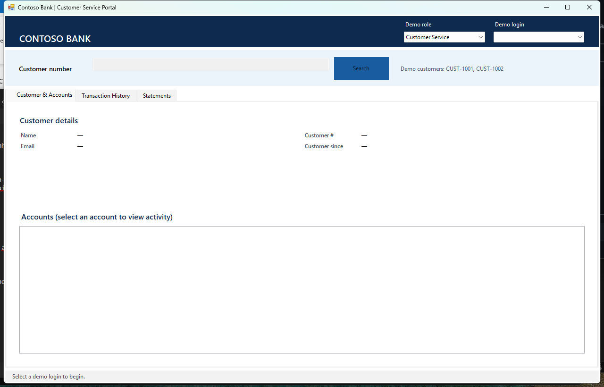

# Contoso Legacy Bank Portal

A branded classic Windows Forms servicing application targeting **.NET Framework 4.8**. It deliberately uses non-SDK projects, `packages.config`, synchronous service orchestration, WCF `BasicHttpBinding`, and Web API 2 conventions to represent a credible legacy desktop workload.

## Features

- Demo role and login selection (no production authentication)
- Seeded customer-number hints: `CUST-1001`, `CUST-1002`
- Customer lookup and profile details
- Account list and account selection
- Transaction history with validated date filters and net-activity calculation
- Statement request, generation-status refresh, and PDF opening through the Windows shell
- Busy, validation, not-found, service-unavailable, generation-failure, and invalid-PDF-location UX

## Prerequisites

- Windows 10/11
- Visual Studio 2022 Build Tools or Visual Studio with:
  - .NET desktop build tools
  - .NET Framework 4.8 targeting pack
- NuGet CLI
- Accounts WCF service at `http://localhost:8090/AccountService`
- Statements Web API 2 service at `http://localhost:8091/api/statements`

## Build and test

Run from a Developer PowerShell:

```powershell
nuget restore .\Contoso.LegacyBank.Portal.sln -NonInteractive
msbuild .\Contoso.LegacyBank.Portal.sln /m /p:Configuration=Release
vstest.console.exe .\tests\Contoso.LegacyBank.Portal.Tests\bin\Release\Contoso.LegacyBank.Portal.Tests.dll
```

Launch:

```powershell
.\src\Contoso.LegacyBank.Portal\bin\Release\Contoso.LegacyBank.Portal.exe
```

Service URLs can be changed in `src\Contoso.LegacyBank.Portal\App.config`.

## Manual smoke test



1. Start both local backend services and verify ports 8090 and 8091 are listening.
2. Launch the portal and choose a demo login.
3. Search for `CUST-1001`; verify customer details and at least one account render.
4. Select an account, open **Transaction History**, choose a valid range, and load activity.
5. Verify amounts, dates, and net activity are formatted correctly.
6. Open **Statements**, request a statement, then refresh until status is ready.
7. Select **Open PDF** and verify the generated document opens in the registered PDF/browser application.
8. Stop each backend in turn and verify the portal shows service-unavailable guidance.
9. Try an empty customer number, a reversed date range, and a range over one year.
10. Exercise a backend generation failure and verify the failure status/message is visible.

## Documentation

- [Architecture](docs/architecture.md)
- [Modernization notes](docs/modernization.md)
- [Screenshot capture guidance](docs/images/README.md)

No runtime screenshots are committed because the UI must be captured from an actually running application and services.
