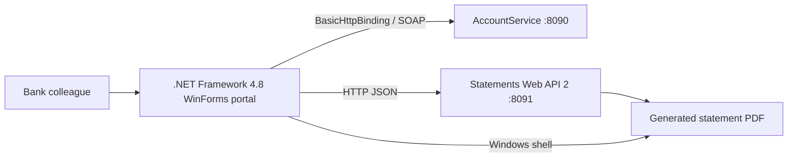

# Architecture

## Runtime view

## Project layout

- `Domain`: WCF data contracts and statement request/response models.
- `Services`: interfaces, generated-style `ClientBase<T>` WCF proxy, and synchronous `HttpClient` adapter.
- `Presentation`: pure validation, status mapping, aggregation, and formatting functions.
- `UI`: programmatic WinForms composition and legacy synchronous orchestration.
- `tests`: MSTest tests for deterministic presentation behavior.

## Service contracts

The committed `IAccountService` contract avoids a build-time dependency on Visual Studio Connected Services. It mirrors the `urn:contoso:legacy-bank:accounts:v1` service/data-contract namespace, typed account faults, and DTO member order. It uses `BasicHttpBinding` against `http://localhost:8090/AccountService` and exposes:

- `GetCustomer(customerNumber)`
- `GetAccounts(customerNumber)`
- `GetTransactions(accountNumber, fromDate, toDate)`

The statement client posts JSON to `http://localhost:8091/api/statements` and polls `GET /api/statements/{jobId}`. A successful create response includes `jobId`, `status`, and `statusUrl`; a completed status response includes `pdfPath`.

## Operational characteristics

- Calls are synchronous by design to reflect the legacy baseline.
- Timeouts are bounded and WCF channels are aborted after faults.
- Configuration is externalized in `App.config`.
- The UI never manufactures customer or account data; seeded values are hints only.
- PDF locations are restricted to HTTP, HTTPS, or file URIs before shell launch.
